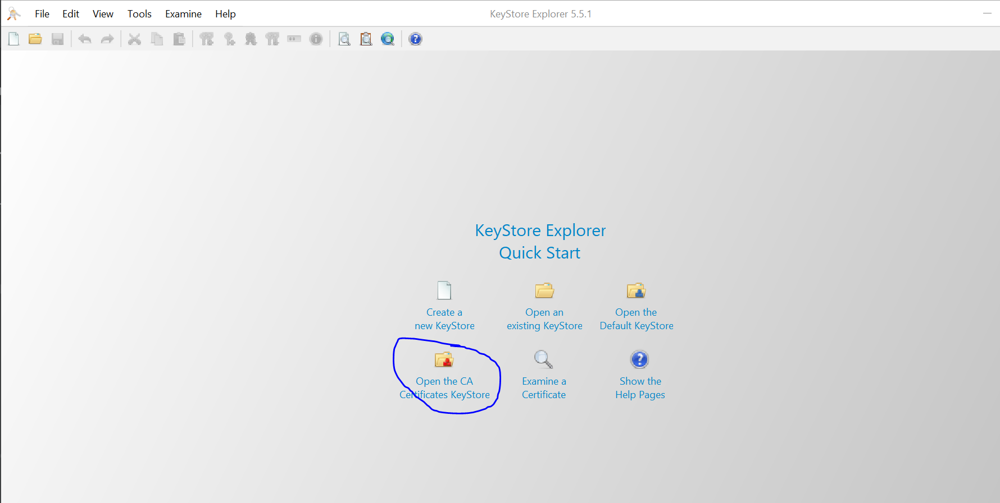
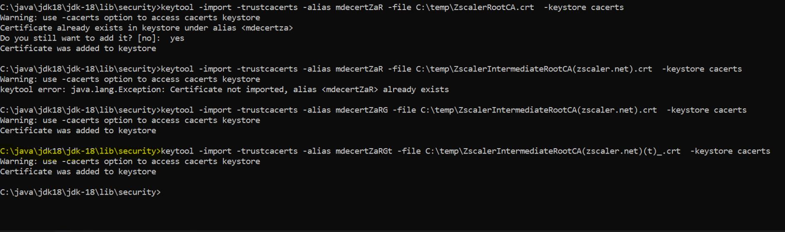

Prova de conceito EMP  Aliança

Integração entre consumer e EMP usando Kafka Client

1) Configuração de cerificados
   1) Instalar ferramenta (KeyStore Explorer) para inclusão dos certificados necessários. Este caso se aplica à máquinas com restrições de acesso ao portal confluent.
   2) 
   3) Instalar os certificados abaixo. Estão na raíz do projeto
    
   4) Instalar os certificados no cacert do JDK
      1) Rodar comando para cada certificado >> keytool -import -trustcacerts -alias cert1 -file C:\temp\ZscalerIntermediateRootCA(zscaler.net)(t)_.crt  -keystore cacerts
      2) 
      3) Reiniciar IDEs que porventura estejam abertas

   
2) Pontos importantes
   1) No application.properties estão as configurações para acesso ao bootstrap server e schema registry. Validar em tempo de desenvolvimento se estão corretos
   2) Os exemplos de código contém validação em formato AVRO

